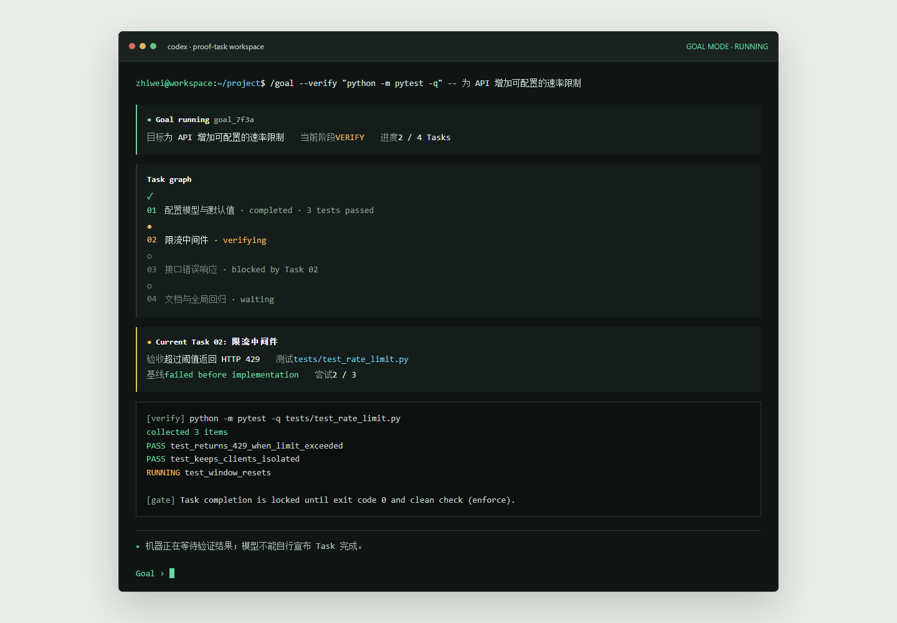

# ProofTask

**可验证的自主编码执行器：让 AI 不只会反复改代码，而是能用测试结果证明：这次改动真的可以交付。**

[](https://www.python.org/)
[](https://github.com/1074739572/claude-code_exchange)
[](https://github.com/1074739572/claude-code_exchange)

ProofTask 是一个面向真实代码仓库的 Agent Harness。它把复杂需求拆成可交付的 `Task`，并要求每个 Task 都有验收标准、真实测试绑定和机器验证证据。

```text
Goal -> Task -> Acceptance Cases -> Test Binding -> Evidence -> Delivery
```

<p align="center">
  
</p>

<p align="center"><sub>Goal 执行时，模型的工作过程与机器是否允许推进会被明确分开。</sub></p>

## 为什么需要 ProofTask

普通 Agent 擅长持续修改代码，却容易把“做过很多操作”误认为“需求已经交付”。ProofTask 把完成定义收敛为可审计的事实：绑定测试实际通过，证据已经保存，依赖关系可以继续推进。

核心原则很简单：

- 模型说“完成了”不算完成。
- Todo 全部完成不算完成。
- 只有绑定测试实际通过，Task 才能完成并解锁下一步。

## 核心工作流

1. **Goal 拆分 Task**：每个 Task 有行为描述、Given / When / Then 验收条件和依赖关系。
2. **测试先绑定**：selector 必须来自 pytest 实际收集结果，模型不能编造路径或命令。
3. **缺测试先生成**：`goal_test_writer` 只为当前 Task 写聚焦测试；新测试必须在实现前先失败。
4. **机器证据验收**：保存命令、退出码、selector、收集数量、输出摘要和代码快照。
5. **严格完成门槛**：没有零退出码证据或 clean check 失败，Task 不能完成。
6. **最终全量复核**：Goal 交付前重跑所有 Task 的绑定测试，再执行全局回归命令。

## 与普通 Agent 的区别

| 普通循环式 Agent | ProofTask |
| --- | --- |
| 关注下一轮继续尝试 | 关注下一步是否有足够证据 |
| 测试命令可能由模型临时猜测 | selector 必须来自真实测试目录 |
| Todo 容易被误认为交付完成 | Todo 不影响 Task 验证状态 |
| 失败可能混入后续工作 | 失败固定回到当前 Task |
| 恢复依赖对话上下文 | Goal / Task 图和状态可持久化恢复 |

## 快速开始

```bash
pip install -r requirements.txt
python main.py
```

创建一个 Goal 草案：

```text
/goal 修复分页接口并补齐边界测试
```

系统会读取 `HARNESS.md`、测试配置和实际 pytest 收集结果，先提出无法从仓库判断的问题，再预览 Task、验收条件、测试方案和全局回归命令。它不会在此阶段写代码。

确认与控制：

```text
/goal preview
/goal answer 空页也必须返回统一结构
/goal approve   # 只允许生成测试并验证失败基线
/goal run       # 审阅测试后，允许进入业务实现
/goal status
/goal pause
/goal resume
/goal cancel
```

`/goal --verify "<command>" -- <需求>` 仍可手动覆盖推断出的全局回归命令。

## 验证

```bash
python -m pytest -q tests/test_goal_module.py tests/test_goal_task_contract.py tests/test_goal_clean_scope.py
python -m evals
```

当前结果：`11 passed`；完整评估 `81 passed, 0 failed, 2 skipped`。

## 文档

- [ProofTask 工作手册](HARNESS.md)
- [ProofTask 设计说明：问题、原则与机器判定](docs/proof-task-design.md)
- [Goal / Task / 测试验证设计](docs/goal-task-verification-plan.md)
- [面向使用者的完整介绍](readme.txt)

## 项目定位

ProofTask 不是另一个只会延长上下文的 Agent Loop。它把“目标 -> 任务 -> 测试 -> 证据 -> 交付”连成闭环，让复杂任务中的每一次推进都值得信任。

本项目基于 [learn-claude-code](https://github.com/shareAI-lab/learn-claude-code) 的 Agent Harness 思路持续演进。
